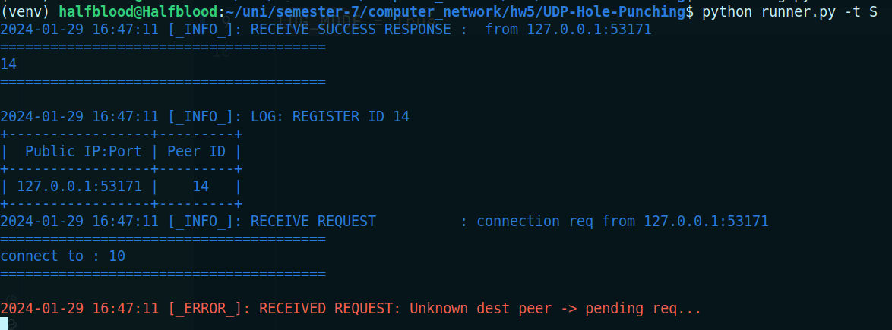
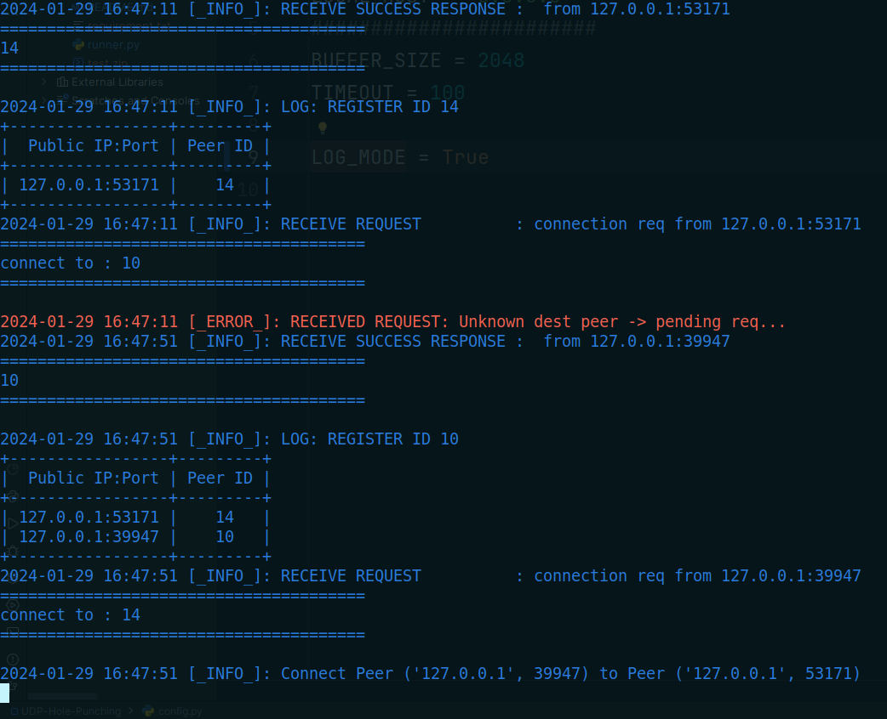
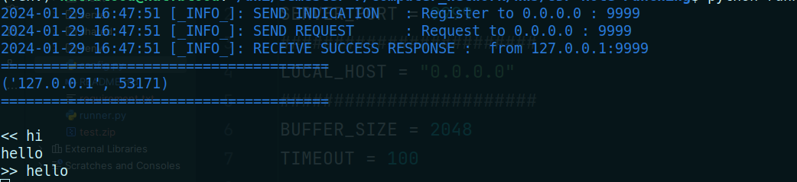
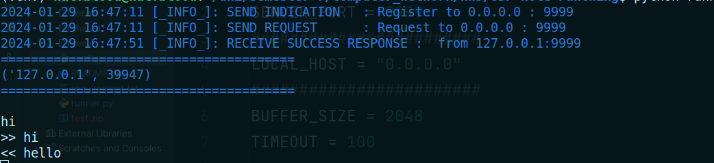

Student Name   : Arash Yadegari

Student Number : 99105815

# UDP Hole Punching

In this file I will review the related concepts and provide a documentation
to my implementation.

> - using python3.10 is recommended otherwise install requirement manually
> - use `python runner.py` for configuring a client or a server

## STUN Header Format

Due to RFC5389 the STUN protocol messages following this format:

       0                   1                   2                   3
       0 1 2 3 4 5 6 7 8 9 0 1 2 3 4 5 6 7 8 9 0 1 2 3 4 5 6 7 8 9 0 1
      +-+-+-+-+-+-+-+-+-+-+-+-+-+-+-+-+-+-+-+-+-+-+-+-+-+-+-+-+-+-+-+-+
      |0 0|     STUN Message Type     |         Message Length        |
      +-+-+-+-+-+-+-+-+-+-+-+-+-+-+-+-+-+-+-+-+-+-+-+-+-+-+-+-+-+-+-+-+
      |                         Magic Cookie                          |
      +-+-+-+-+-+-+-+-+-+-+-+-+-+-+-+-+-+-+-+-+-+-+-+-+-+-+-+-+-+-+-+-+
      |                                                               |
      |                     Transaction ID (96 bits)                  |
      |                                                               |
      +-+-+-+-+-+-+-+-+-+-+-+-+-+-+-+-+-+-+-+-+-+-+-+-+-+-+-+-+-+-+-+-+

Where `message type` indicates the method and class of message.

For sake of simplicity, only **request** and **response** messages are handled.
**Indication** messages will be used for informing the `Public IP` of peers.

`Magic Cookie` MUST be set to `0x2112A442` due to RFC.

`Transaction ID` is generated randomly by the client and echoed by the server in response
message.

## STUN Over UDP

In this section, the procedures that must be taken by client and server to
serve correctly are mentioned.

## STUN Client

STUN client may send a STUN request to STUN server. Also, it must be able to receive
response form STUN server.

### Indication

Client may send an indication to STUN server. Indication may contain information like `Client ID`.
Server does not need to send a response to indication messages.

### Request

Client may send a request to STUN server to get IP/PORT of the other peer/client.
This message must contain Public IP of NAT/NATs that contains client device or NATs belongs to precedence layers.

### Response

Client may receive a response from STUN server. The message must contain the same ID of request transaction.
Client must configure the destination IP and PORT based on the success response.

## STUN Server

STUN Server may receive STUN requests from clients. It must be able to set a correct mapping between clients
and send response to clients.

### Indication

Server may send an indication to peers that send a request to server. This transaction will contain
the `PUBLIC IP & PORT` of the last layer NAT.

### Response

Servery may send a response to peers. This response must contain the same transaction ID with the request.
Response must contain requested information like IP and PORT of the other peer.

## Errors

STUN Client and Server must be able to handle request correctly. For sake of simplicity, messages with errors
will be detected and dropped i.e. there is no mechanism of handling errors as it is not needed.

# Run Example

First set `LOG_MODE` to keep track of client and server actions.

## Simple Peer To Peer Example

In this example we are going to register 2 peers into the server
and send simple messages.

- Server

```shell
python runner.py -t S
```

____

- Client 10
  Send Request to get Client 14 INFO

```shell
python runner.py -t C -si 10 -di 14
```

___

- Client 14
  Send Request to get Client 10 INFO

```shell
python runner.py -t C -si 10 -di 14
```

### SNAPSHOTS

server log after client 14 request


server log after client 10 and 14 requests


client log with id 10


client log with id 14

